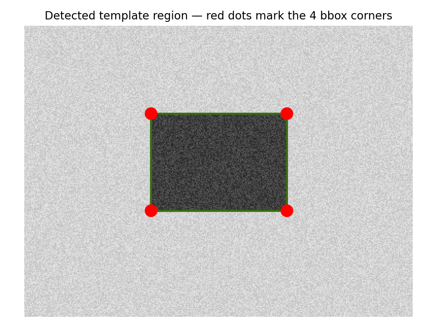
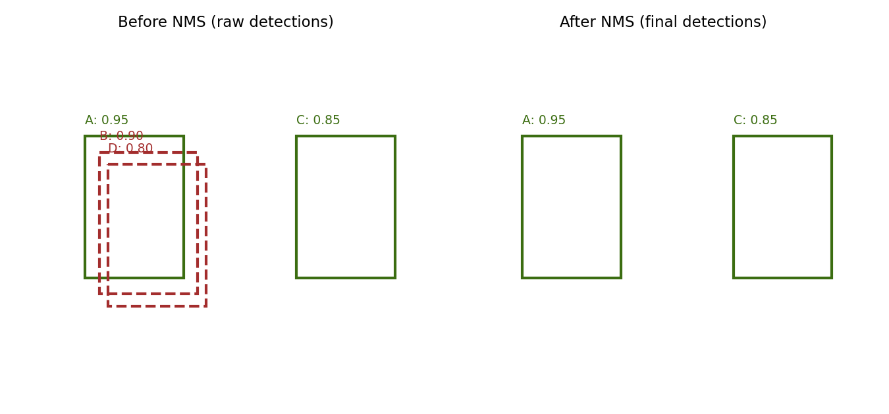

# Template Matching — Find a Template Inside an Image

Given a **source image** and a **template image**, this project locates where the template appears inside the source image and marks the four corners of each detected bounding box with a **red dot**.

Works for both:
- A single best match
- Multiple repeated matches (with non-max suppression to remove duplicate/overlapping detections)

---

## Table of contents

- [How it works](#how-it-works)
- [Repo structure](#repo-structure)
- [Run it on Google Colab](#run-it-on-google-colab)
- [Run it on your PC](#run-it-on-your-pc)
- [Usage / parameters](#usage--parameters)
- [The matching method](#the-matching-method)
- [Removing duplicate detections (NMS)](#removing-duplicate-detections-nms)
- [Limitations](#limitations)
- [License](#license)

---

## How it works

\`\`\`mermaid
flowchart TD
    A[Source image] --> C[Convert both to grayscale]
    B[Template image] --> C
    C --> D["cv2.matchTemplate()"]
    D --> E{Single or multi match?}
    E -->|Single| F["minMaxLoc() → best score"]
    E -->|Multi| G["Threshold score matrix → many boxes"]
    G --> H["Non-max suppression → remove duplicates"]
    F --> I["Compute bbox: top_left + template size"]
    H --> I
    I --> J["Draw red dots on the 4 corners"]
    J --> K[Save annotated output image]
\`\`\`

1. Both images are converted to **grayscale** — matching is faster and more robust on intensity patterns than raw color.
2. \`cv2.matchTemplate\` slides the template over every position in the source image and gives each position a **similarity score**.
3. **Single mode** just takes the single highest-scoring position.
   **Multi mode** keeps every position above a score threshold, then removes near-duplicate boxes with **non-max suppression (NMS)**.
4. Each kept match's bounding box corners are computed from its top-left point + the template's width/height.
5. A red dot is drawn on each of the 4 corners, and the result is saved as an image.

---

## Repo structure

\`\`\`
TemplateMatching_cv_assignment_no__1/
├── cv_2026_Assignment_1_(Template_Matching).ipynb   # Google Colab notebook version
├── template_matching.py                             # Plain Python script version (for PC use)
├── corner_dots_example.png                          # Image used in this README
├── nms_before_after.png                              # Image used in this README
└── README.md
\`\`\`

---

## Run it on Google Colab

No installation needed — everything runs in the browser.

1. Open the notebook directly in Colab:
   
2. Run **Cell 1** — installs OpenCV and imports libraries.
3. Run **Cell 2** — you'll be prompted to upload your **source image**, then your **template image**.
4. Run **Cell 3** — loads the core functions (no output).
5. Run **Cell 4** for a single best match, and/or **Cell 5** for multiple matches.
6. The annotated image displays inline, right in the notebook.

---

## Run it on your PC

If you'd rather run this locally instead of Colab:

1. **Clone the repo**
   \`\`\`bash
   git clone https://github.com/HaseebUlHassan437/TemplateMatching_cv_assignment_no__1.git
   cd TemplateMatching_cv_assignment_no__1
   \`\`\`

2. **Install the dependencies**
   \`\`\`bash
   pip install opencv-python numpy
   \`\`\`

3. **Run the script**
   \`\`\`bash
   python template_matching.py --image path/to/image.jpg --template path/to/template.jpg --mode single --output result.jpg
   \`\`\`

   For multiple matches:
   \`\`\`bash
   python template_matching.py --image path/to/image.jpg --template path/to/template.jpg --mode multi --threshold 0.85 --output result.jpg
   \`\`\`

4. Open \`result.jpg\` — it will show your source image with red dots marking the 4 corners of every detected match.

---

## Usage / parameters

| Flag | Meaning | Default |
|---|---|---|
| \`--image\` | Path to the source image | required |
| \`--template\` | Path to the template image | required |
| \`--mode\` | \`single\` (best match only) or \`multi\` (all matches above threshold) | \`single\` |
| \`--threshold\` | Minimum similarity score to count as a match (multi mode only, 0–1) | \`0.8\` |
| \`--overlap-thresh\` | IoU threshold used by NMS to decide what counts as a "duplicate" (multi mode only) | \`0.3\` |
| \`--output\` | Where to save the annotated result image | \`result.jpg\` |
| \`--dot-radius\` | Radius (in pixels) of the corner dots | \`6\` |

**Do you need to resize your images?**
No — as long as your template is a genuine same-scale crop of something appearing in the source image (the normal case). You *do* need to resize if the template appears at a different scale in the source image, since plain template matching has no built-in scale invariance (see [Limitations](#limitations)).

---

## The matching method

By default this uses OpenCV's \`TM_CCOEFF_NORMED\` — normalized cross-correlation. For every window position, it:

1. Subtracts the **template's own mean** from every template pixel.
2. Subtracts **that window's own mean** from every pixel in the current image window.
3. Correlates the two "centered" patches — this is mathematically the Pearson correlation coefficient.

$$
R(x,y) = \frac{\sum T'(x',y') \cdot I'(x+x',y+y')}{\sqrt{\sum T'(x',y')^2 \cdot \sum I'(x+x',y+y')^2}}
$$

The result is always between **−1** (perfect inverse) and **+1** (perfect match), and — critically — it's independent of overall brightness, so a dim and a bright version of the same pattern still score close to 1.

\`cv2.minMaxLoc()\` then simply scans this score grid for the highest value (or the lowest, for the two \`SQDIFF\` methods, which measure difference instead of similarity — see the comparison table in the script's docstring/comments).

---

## Removing duplicate detections (NMS)

In multi-match mode, a real match doesn't score high at just one pixel — it scores high across a small *cluster* of neighboring pixels, since shifting the window by 1 pixel barely changes the overlap. Left alone, this produces many overlapping boxes for the same object.

**Non-max suppression (NMS)** fixes this: sort all candidate boxes by score, always keep the highest-scoring box in the current group, then discard any remaining box that overlaps it by more than \`--overlap-thresh\` (measured as IoU — Intersection over Union). Repeat until nothing's left.

\`\`\`mermaid
flowchart LR
    A["Sort boxes by score, highest first"] --> B["Keep top box"]
    B --> C["Compute IoU of kept box vs. all remaining boxes"]
    C --> D{"IoU > threshold?"}
    D -->|Yes| E["Discard as duplicate"]
    D -->|No| F["Keep for next round"]
    F --> B
\`\`\`

---

## Limitations

- **Not rotation-invariant** — if the template appears rotated in the source image, plain template matching will fail.
- **Not scale-invariant** — if the template appears at a different size than in the source image, matching will likely fail or score poorly. If this applies to your case, try resizing the template to a few candidate scales and keep whichever gives the best score, or switch to feature-based matching (ORB/SIFT + \`cv2.findHomography\`) instead.
- Works best when the template is a clean, same-scale crop taken directly from the source image (or an image of the same scene/scale).

---

## License

MIT — feel free to use, modify, and share.
